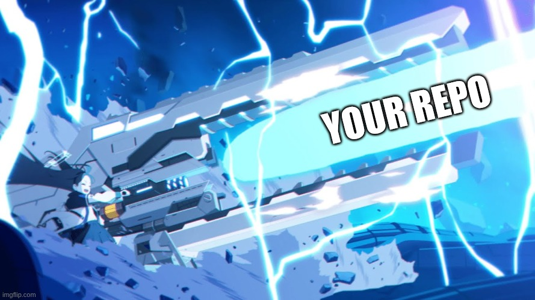

# @haskou/railgun

[](https://github.com/haskou/railgun/actions/workflows/ci.yml)
[](https://www.npmjs.com/package/@haskou/railgun)
[](LICENSE)
[](https://renovatebot.com/)

CLI to initialize DDD projects with `@haskou/ddd-kernel` and add contexts and integrations.

## Installation

```bash
npm i -g @haskou/railgun
```

## Usage

```bash
  railgun init
  railgun add context <Name>
  railgun add express
  railgun add npm
  railgun add renovate
  railgun help

Commands:
  init                 Initialize a DDD TypeScript project.
  add context <Name>   Add a generated DDD context.
  add express          Add ExpressKernelServer and health route.
  add npm              Add npm CI workflow and README badge.
  add renovate         Add Renovate config and README badge.
```

There is a `man railgun` available.

## Release Branches

CI publishes npm versions from pull requests merged into the default branch
according to the source branch prefix:

| Branch prefix | npm version bump |
| ------------- | ---------------- |
| `fix/*`       | Patch            |
| `feat/*`      | Minor            |
| `break/*`     | Major            |

Other branch names run validation only and do not publish.

## License

MIT. See [LICENSE](LICENSE).

## Disclaimer

@haskou/railgun is not affiliated with, endorsed by, or sponsored by NEXON, NEXON Games, Yostar, or the Blue Archive team.
